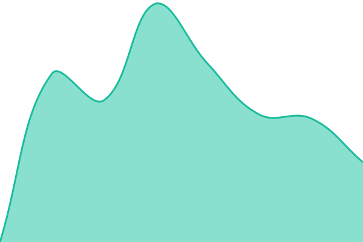

# [📈 Live Status](https://themillhouse.github.io/ratifia-status-stage): <!--live status--> **🟩 All systems operational**

This repository contains the open-source uptime monitor and status page for [themillhouse](https://themillhouse.github.io/ratifia-status-stage), powered by [Upptime](https://github.com/upptime/upptime).

With [Upptime](https://upptime.js.org), you can get your own unlimited and free uptime monitor and status page, powered entirely by a GitHub repository. We use [Issues](https://github.com/themillhouse/ratifia-status-stage/issues) as incident reports, [Actions](https://github.com/themillhouse/ratifia-status-stage/actions) as uptime monitors, and [Pages](https://themillhouse.github.io/ratifia-status-stage) for the status page.

<!--start: status pages-->
<!-- This summary is generated by Upptime (https://github.com/upptime/upptime) -->
<!-- Do not edit this manually, your changes will be overwritten -->
<!-- prettier-ignore -->
| URL | Status | History | Response Time | Uptime |
| --- | ------ | ------- | ------------- | ------ |
|  [Stage API](https://api.stage.ratifia.com/health) | 🟩 Up | [stage-api.yml](https://github.com/themillhouse/ratifia-status-stage/commits/HEAD/history/stage-api.yml) | 

 251ms
     
 | 

<a href="https://themillhouse.github.io/ratifia-status-stage/history/stage-api">100.00%</a>
    

|  [Stage Dashboard](https://app.stage.ratifia.com/sign-in) | 🟩 Up | [stage-dashboard.yml](https://github.com/themillhouse/ratifia-status-stage/commits/HEAD/history/stage-dashboard.yml) | 

 468ms
     
 | 

<a href="https://themillhouse.github.io/ratifia-status-stage/history/stage-dashboard">100.00%</a>
    

<!--end: status pages-->

[**Visit our status website →**](https://themillhouse.github.io/ratifia-status-stage)

## 📄 License

- Powered by: [Upptime](https://github.com/upptime/upptime)
- Code: [MIT](./LICENSE) © [Anand Chowdhary](https://anandchowdhary.com)
- Data in the `./history` directory: [Open Database License](https://opendatacommons.org/licenses/odbl/1-0/)
